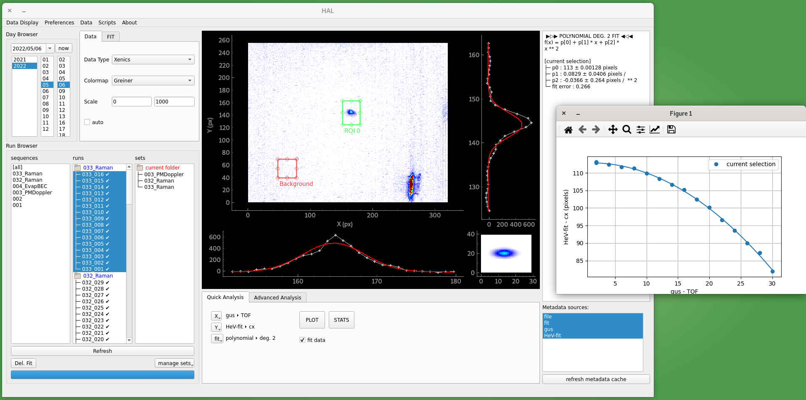

# HAL 🔴 Atom Locator

[](https://github.com/psf/black)





## 🚨🚨🚨 DISCLAIMER 🚨🚨🚨

**2021-06-24 : The user-module structure was modified. User scripts, that used to be located in `HAL.modules` should now be put in the user configuration folder, i.e. in `~/.HAL/user_modules`. Refer to the section 3 of this README file "Install user modules"**


## 👍 Start with HAL without problems

### ⚠️ preamble ⚠️

We try to develop HAL using recent versions of python 🐍🐍🐍 (currently 3.9). HAL was found to work for earlier version (such as 3.8), but we cannot guarantee that this compatibility will be maintained during future development. We thus strongly encourage you to use the latest version of python for HAL.

_Note_ : if you use the [anaconda python distribution](https://www.anaconda.com/), you have and independent version of python in each virtual environment. This could be a solution to use HAL with a recent version of python without messing with our OS' python 😉

### 1️⃣ install HAL core

First, you have to install HAL from the current repository, with the following steps

#### Clone the repository from github

```bash
$> git clone https://github.com/adareau/HAL.git
```

#### Create an virtual environment with the required packages


##### short version

We strongly suggest that you use HAL in a dedicated virtual environment. This can be done using the python `venv` module (https://docs.python.org/3/library/venv.html) or, if you use the anaconda python distribution, with the builtin `conda create --name envname` command.

This environment should contain all the required packages. We try to provide an up-to-date list of requirements in a [pip-compatible](https://github.com/adareau/HAL/blob/testing/requirements_pip.txt) (`requirements_pip.txt`) and a [conda-compatible](https://github.com/adareau/HAL/blob/testing/requirements_conda.txt)(`requirements_conda.txt`) formats in the repository.

##### long version (python3-venv)

We strongly suggest that you use HAL in a dedicated virtual environment. In a debian-based linux distribution (such as Ubuntu), you need the package `python3-venv`. If you do not already have it, install it:

```bash
$> sudo apt-get install python3-venv
```

Now create a dedicated environment (we call it `halenv`):

```bash
$> python3 -m venv halenv
```

Activate it:

```bash
$> source halenv/bin/activate
```

Now that we work in halenv (as indicated in the terminal) install all the required packages, either running this command:

```bash
(halenv) $> pip3 install jsbeautifier pyqt5 numpy scipy matplotlib pyqtgraph pyautogui opencv-python-headless h5py
```

Or using the `requirements_pip.txt` file (in the root of the git repository):

```bash
(halenv) $> pip3 install -r requirements_pip.txt
```

##### long version (python3.9-venv)
I described below, we recommand you to use HAL within a python3.9 environnement. We will describe below the procedure to install both python3.9 and HAL in an environnemnt called `halenv` on your computer. First, download python3.9  on your computer with the following command lines :

```bash
$> sudo apt update
$> sudo apt install software-properties-common
$> sudo add-apt-repository ppa:deadsnakes/ppa
$> sudo apt install python3.9
```

Now you have access to python3.9. To use it, enter python3.9 instead of python3 in your shell. We do not recommand to set that python3 is python3.9 since it could dammage your system. However, we will use python3.9 in our environnement: we need therefore the package `python3.9-venv`. If you do not already have it, install it:

```bash
$> sudo apt-get install python3.9-venv
```

Now create a dedicated environment (we call it `halenv`):

```bash
$> python3.9 -m venv halenv
```

Activate it:

```bash
$> source halenv/bin/activate
```

Now that we work in halenv (as indicated in the terminal) install all the required packagesusing the `requirements_pip.txt` file (in the root of the git repository):

```bash
(halenv) $> pip3 install -r root/to/your/HAL/folder/requirements_pip.txt
```

##### long version (anaconda)

Alternatively, you can use conda to create the virtual environment, with a one-line command:

```bashconda
$> conda create --name halenv --file requirements_conda.txt  # create the env
$> conda activate halenv  # activate it
```


###  2️⃣ Start HAL

Now, you can start HAL using the `start` file (in the root of the git repo):

```bash
(halenv) $> python3 ./start
```

Or directly with bash (making sure that it is executable)

```bash
(halenv) $> chmod +x ./start # to make it executable, only the first time
(halenv) $> ./start

```

###  3️⃣ Install user modules

HAL is based on user modules. Those modules are in fact python classes, that should inherit from the abstract classes defined in `HAL/classes`. The modules are used by HAL to:

+ access raw data (such as camera pictures) that will be displayed & fitted, with the `data` classes
+ access metadata linked to the raw data (experimental parameters for instance) with the `metadata` classes
+ fit the data with the `fit` classes
+ organize the main display with the `display` classes

Some default modules are shipped with HAL. They are located in `HAL/default_modules`, with the following structure

```
└── HAL
    ├── default_modules
    │   ├── data
    │   ├── display
    │   ├── fit
    │   └── metadata
    │
    ...
```

User-defined modules should be located in `~/.HAL/user_modules`. Some examples of user-defined modules can be found in a dedicated github respository: https://github.com/adareau/HAL-modules. The content of is repository is meant to be cloned / copied directly in the `~/.HAL/user_modules` folder. If you would like to contribute your modules to this repository, just make a pull request (making sure that your modules are in a folder whose name is not alreay used).

In order to prevent some modules to be loaded (for instance, the `RawCamData` data example that is provided in the default_modules), just add this line to the config file:

```
[global]
ignored modules list = RawCamData,
```


**TODO** some documentation on how to write modules ?

## 👩‍💻 Notes for programmers 👨‍💻

### 📝 Some useful commands

**Build the gui**

```bash
$> pyuic5 main.ui > MainUI.py
```

### 🖼️ PyQtGraph

We use the PyQtGraph package for image and data display (mostly because it is faster than matplotlib). Useful links :

* [official website](http://www.pyqtgraph.org/)
* [documentation](https://pyqtgraph.readthedocs.io/en/latest/)

To see examples (useful to start programming):

```bash
$> python -m pyqtgraph.examples
```


